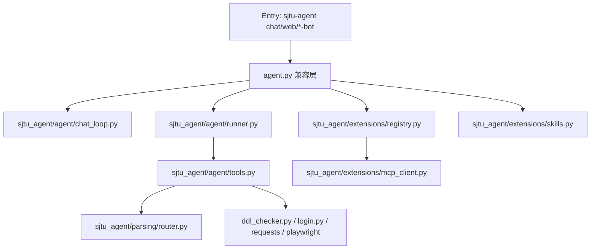

# SJTU Agent 架构深度解读（Agent 部分）

本文聚焦 `agent` 相关实现，目标是让你能从“入口命令 -> 模型调用 -> 工具执行 -> 多端适配”整条链路快速定位代码、理解设计和排查问题。

## 1. Agent 边界与角色

这个项目的 Agent 层本质是一个“**带工具调用的对话执行内核**”，上层可以接 CLI、Web、Telegram、Feishu、QQ、WeChat，不同入口共用同一套：

1. System Prompt（行为约束）
2. 模型客户端选择（OpenAI 兼容 / Anthropic）
3. Tool calling 循环
4. 工具实现（校园业务 + 配置 + 解析 + Bot 配置）

核心代码位置：

- `agent.py`（兼容入口，re-export）
- `sjtu_agent/agent/`（主内核）
- `sjtu_agent/extensions/`（MCP / Skill 扩展层）
- `sjtu_agent/parsing/`（文件解析路由）
- `scripts/*_bot.py`、`sjtu_agent/web/server.py`（各端适配层）

## 2. 代码分层（从下到上）

## 3. 核心模块职责

### 3.1 `sjtu_agent/agent/chat_loop.py`

负责交互式 CLI 聊天的主流程：

- 加载/初始化模型配置：`load_agent_config()` / `setup_agent_config()`
- 启动前检查：`tool_check_setup()`
- 注入时间与学期上下文（每轮刷新）
- 调用 `runner._run_one_turn(...)`

它是 `sjtu-agent chat` 的主循环入口。

### 3.2 `sjtu_agent/agent/runner.py`

负责“**单轮推理 + 工具循环**”：

- `_make_client(cfg)`：按模型名选 OpenAI 或 Anthropic 客户端
- `_run_one_turn_openai(...)`：OpenAI 兼容流式 + tool calls
- `_run_one_turn_anthropic(...)`：Anthropic SSE + tool_use
- `Spinner`：终端状态展示

重点：runner 只关心对话协议，不关心具体业务逻辑，业务在 tools。

### 3.3 `sjtu_agent/agent/tools.py`

负责“**工具定义 + 工具实现 + 分发**”：

- `TOOLS`：内置工具 schema（function calling 可见集合）
- `tool_xxx(...)`：所有业务动作（DDL、成绩、课表、搜索、Bot 配置、解析等）
- `run_tool(name, args)`：工具分发入口

这里是项目最大、最关键的业务层。

### 3.4 `sjtu_agent/agent/prompts.py`

负责系统提示词与工具状态文案：

- `SYSTEM_PROMPT`：主行为规则（很长）
- `_TOOL_LABELS`：工具执行中的人类可读状态文案
- `build_system_prompt(...)`：可拼接 Skill Prompt

### 3.5 `sjtu_agent/extensions/*`

- `skills.py`：读取 `skills.enabled` 与 skill 目录，拼接 `SKILL.md` 内容
- `mcp_client.py`：MCP tools 发现/调用（支持 stdio/sse/http）
- `registry.py`：组合“内置 tools + MCP tools”

### 3.6 `sjtu_agent/parsing/router.py`

统一解析路由，支持：

- 文本、HTML、CSV/JSON、DOCX、PPTX、ZIP、PDF
- 图像 OCR（PaddleOCR）
- 音频 ASR（Whisper）
- PDF/PPT 的 OCR 回退链路

## 4. 从 CLI 到一次回答的完整链路

以 `sjtu-agent chat` 为例：

1. `sjtu_agent/cli.py::_cmd_chat` -> `run_module("agent")`
2. `agent.py` -> `sjtu_agent.agent.main()`（chat_loop.main）
3. 读取模型配置；若无配置，走交互式 setup
4. 初始化 `messages=[system]`
5. 用户输入后追加 `{"role":"user"}`
6. `runner._run_one_turn(...)` 发起流式调用
7. 若模型返回 tool call：`tools.run_tool(...)` 执行并回填 tool message
8. 循环直到返回最终 assistant 文本

## 5. Tool 调用机制（协议层视角）

### OpenAI 路径

- 请求体含 `tools=TOOLS`、`tool_choice="auto"`
- 流式收集 `delta.content` 与 `delta.tool_calls`
- 工具调用完成后把 tool result 作为 `{"role":"tool"}` 写回消息

### Anthropic 路径

- 把 OpenAI 风格工具转换为 Anthropic `input_schema`
- 处理 `content_block_start/delta/stop`
- tool_use 的 input_json 增量拼接后反序列化
- 工具结果作为 `{"type":"tool_result"}` 回填

## 6. 文件解析与多模态链路

### 6.1 Tool 入口

- `tool_parse_local_file(...)`
- `tool_parse_local_files(...)`

行为要点：

1. 默认 `strategy="auto"` 走 `parsing.router.parse_file`
2. 若 router 失败，`.pdf/.html/.htm` 会回退到旧链路 `tool_read_assignment_file`
3. 在交互式 TTY 聊天里，若缺 OCR/ASR 依赖，会询问是否自动安装后重试

### 6.2 Router 的关键策略

- PDF：先 `pypdf` 抽文本，空文本再尝试 `pdf_ocr`（若依赖齐全）
- PPTX：先抽 slide XML 文本，空文本再尝试图片 OCR
- 图片：有 `paddleocr` 就 OCR；否则返回 stub + warning
- 音频：有 `whisper` 就转写；否则返回 stub + warning

### 6.3 后端安装脚本

- `scripts/install_parse_backends.py`
- 当前固定版本：
  - `paddleocr==3.6.0`
  - `pypdfium2>=4.30,<5`
  - `openai-whisper==20250625`

## 7. 多端接入方式（与 agent 内核关系）

### 7.1 Telegram / Feishu / QQ / WeChat

四个脚本都采用同一种模式：

1. 维护各自 session（每个用户/会话一份 `messages`）
2. 更新 system prompt（含时间上下文和平台约束）
3. 调 `agent._run_one_turn(...)`
4. 捕获 stdout，取最后 `Agent: ` 后文本作为回复
5. 文件/图片/音频先下载到本地，再走 `tool_parse_local_file` 或多模态输入

### 7.2 Web

`sjtu_agent/web/server.py` 自己实现了流式与 tool loop（不直接复用 runner），但仍调用 `agent.run_tool(...)` 执行业务工具。

## 8. MCP / Skill 扩展机制（当前实现）

### MCP

- 通过 `tool_add_mcp_server(...)` 写入 `config.json.mcp_servers`
- `extensions.mcp_client` 负责发现工具并映射成 `mcp__{server}__{tool}` 名称
- 工具调用通过 `call_tool(...)` 短生命周期会话执行

### Skill

- 通过 `skills.enabled` + `skills.dirs` 管理
- `extensions.skills.build_skill_prompt()` 会读取 `SKILL.md` 拼接到系统提示词

## 9. 关键配置与状态文件

运行时目录来自 `sjtu_agent/paths.py`（默认 platformdirs，也可 `SJTU_AGENT_HOME` 覆盖）：

- `agent_config.json`：模型配置
- `config.json`：业务配置（token/cookies/mcp/skills 等）
- `reminders.json` / `.ddl_cache.json` / 各种 bot session 文件

## 10. 当前架构里的“重要现状”

下面是理解行为时最容易踩坑的点：

1. `agent.__init__.py` 暴露了 `get_available_tools` / `run_registered_tool`，并把 `agent.run_tool` 指向 registry。
2. 但 `runner._get_tools()` 目前取的是 `sjtu_agent.agent.tools.TOOLS`（内置工具集合）。
3. 因此“模型可见工具集合”默认是内置 `TOOLS`，不是 registry 动态集合。
4. `tools.run_tool(...)` 仍支持 `mcp__` 前缀分发，所以**只要模型产生了 mcp 名称**就能执行；问题在于默认工具列表里未必会暴露这些名称。
5. `build_system_prompt()` 已实现 Skill 拼接，但多入口大量地方直接用 `SYSTEM_PROMPT`，不是统一调用 `build_system_prompt()`。

这几条解释了“为什么某些扩展能力在部分入口可配置但不一定自动生效”。

## 11. 调试时建议的最短路径

### 看一轮工具调用为什么没触发

1. 先看入口是否在用 `runner._run_one_turn`（`scripts/*_bot.py`）
2. 看传给模型的 `tools` 是否为 `agent.TOOLS`
3. 看模型返回里有没有 tool call
4. 看 `tools.run_tool` 分发是否命中

### 看文件解析为什么失败

1. 直接调用 `tool_parse_local_file(..., strategy="auto")`
2. 检查返回 `parser / warnings / error`
3. 缺依赖时跑 `sjtu-agent install-parse-backends`

---

如果你准备做下一步重构，建议优先统一两件事：

1. 所有入口统一使用 `build_system_prompt()`；
2. 所有入口统一使用 `registry.get_available_tools()` 作为模型可见工具列表。

这两步完成后，MCP/Skill 的行为会在 CLI/Web/Bot 间更一致。
