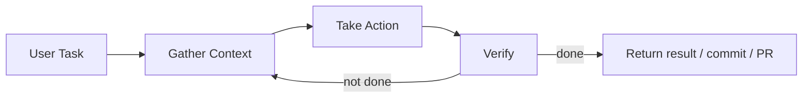

# Claude Code Agent 核心设计解读

> 适用范围：基于 Claude Code 官方文档（`code.claude.com/docs`）的架构解读。  
> 目标：把 Claude Code 的“agent loop + 工具/权限 + 子代理 + 上下文治理”拆成可复用设计原则。

## 1. 一句话定位

Claude Code 的核心不是“聊天 UI”，而是一个“**以工具为中心的代理执行壳（agentic harness）**”：

- 模型负责推理（reasoning）
- 工具负责行动（acting）
- 会话/上下文/权限负责约束与可控性（governance）

## 2. 主执行循环（官方定义）

官方把循环描述为三阶段反复迭代：

1. Gather context（收集上下文）
2. Take action（执行动作）
3. Verify results（验证结果）

本质上是“计划-执行-校验”闭环，并允许用户中途打断与重定向。

## 3. 能力分层

### 3.1 模型层

- 使用 Claude 模型做任务分解、决策与纠错
- 可按任务复杂度切换不同模型（如偏速度/偏推理）

### 3.2 工具层

Claude Code 的 agent 性能来自工具集，而不是 prompt 本身。官方工具能力可归纳为：

- 文件操作（读写改）
- 检索（glob/grep）
- 命令执行（bash）
- 网络能力（web fetch/search）
- 编排能力（Task/Subagent）

工具调用结果持续反馈回下一步决策，形成真正“可执行”的循环。

## 4. 权限系统（核心治理设计）

Claude Code 把权限做成一等公民，关键机制：

1. **Permission Mode**（default / acceptEdits / plan / auto / dontAsk / bypassPermissions）
2. **规则系统**（allow / ask / deny）
3. **规则优先级**（deny > ask > allow）
4. **Hook 介入点**（PreToolUse 等）

这套设计允许在“效率 vs 风险”之间做工程化平衡，而不是靠单一开关。

## 5. 子代理（Subagents）机制

子代理是 Claude Code 的关键扩展点：

- 每个 subagent 有自己的 `name/description/tools/...` 配置
- 主代理可按描述自动委派任务
- 子代理使用独立上下文窗口，完成后只回传摘要

这解决了两个痛点：

1. 大任务拆分（并发/专长化）
2. 主会话上下文膨胀（context pollution）

## 6. 上下文与会话管理

Claude Code 的会话治理非常系统化：

- 会话与工具结果本地持久化（JSONL）
- 上下文接近上限时自动压缩（先清工具输出，再摘要对话）
- 支持 resume / fork session
- 技能与 MCP 工具信息采用按需加载，降低上下文成本

这体现的是“Token 预算管理”而非单次问答优化。

## 7. 扩展层：Skills / Hooks / MCP

### Skills

- 以可复用工作流为单位封装提示与支撑文件
- 支持按目录组织与热更新发现

### Hooks

- 在工具调用前后、子代理结束、会话生命周期等阶段插入外部逻辑
- 可做审计、阻断、自动格式化、策略注入

### MCP

- 标准化连接外部系统（文档、工单、内部工具）
- 让 agent 的“上下文能力”和“执行能力”可插件化扩展

## 8. 从 Claude Code 反推“一个可落地 Agent 框架”最小清单

如果抽象成工程 Checklist，至少要有：

1. 明确的 agent loop（context/action/verify）
2. 统一工具接口与可审计调用日志
3. 权限模式 + allow/deny 规则 + hook 机制
4. 子代理机制（独立上下文 + 回传摘要）
5. 会话持久化与上下文压缩策略
6. 外部能力标准化扩展（类似 MCP）

## 9. 对你当前项目（sjtu-agent）的映射

你的项目已经具备雏形：

- `runner`：已有工具循环
- `tools`：业务动作集中
- `extensions/mcp_client.py`：MCP 扩展入口
- `skills.py`：Prompt-only 技能

还可继续对齐 Claude Code 的点：

1. 把权限/审批抽象成统一模式（而不是分散在 Bot 层）
2. 增加“任务分派子代理”能力（不只是单代理串行）
3. 加强会话压缩和上下文成本可观测性
4. 统一所有入口对同一工具注册表和同一系统提示构建方式

## 10. 资料来源

- Claude Code Overview: [code.claude.com/docs/en/overview](https://code.claude.com/docs/en/overview)
- How Claude Code works: [code.claude.com/docs/en/how-claude-code-works](https://code.claude.com/docs/en/how-claude-code-works)
- Permissions: [code.claude.com/docs/en/permissions](https://code.claude.com/docs/en/permissions)
- Permission modes: [code.claude.com/docs/en/permission-modes](https://code.claude.com/docs/en/permission-modes)
- Hooks: [code.claude.com/docs/en/hooks](https://code.claude.com/docs/en/hooks)
- Subagents: [code.claude.com/docs/en/sub-agents](https://code.claude.com/docs/en/sub-agents)
- MCP: [code.claude.com/docs/en/mcp](https://code.claude.com/docs/en/mcp)
