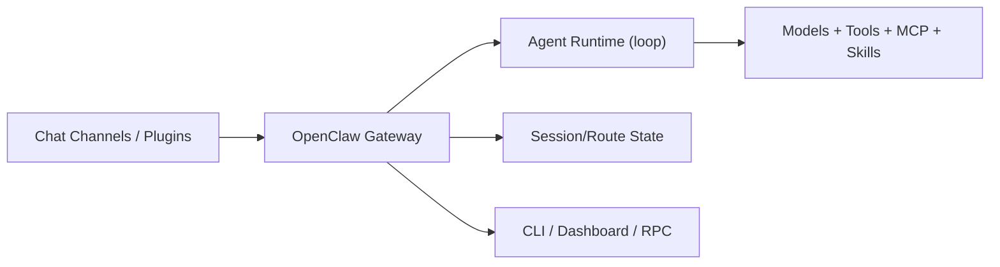

# OpenClaw Agent 核心设计解读

> 适用范围：基于 OpenClaw 官方文档与 `openclaw-qqbot` 官方插件文档的架构解读。  
> 目标：帮助你快速理解 OpenClaw 的 agent 执行骨架、消息通道层、权限与会话隔离设计。

## 1. 一句话定位

OpenClaw 不是单一聊天机器人，而是“**自托管的多通道 Agent 网关**”：

- 上游连接多种聊天通道（内置 + 插件）
- 中间由 Gateway 统一做路由、会话与状态管理
- 下游连接 Agent 能力（模型、工具、子代理、MCP 等）

## 2. 核心分层

关键点：Gateway 是“单一事实源（SSOT）”，会话、路由、通道连接状态都在这里统一维护。

## 3. Agent 执行骨架（概念）

OpenClaw 的 agent 本质是“消息驱动 + 工具执行 + 回写通道”的循环：

1. 通道消息进入 Gateway（带 sender / channel / account / thread 元信息）
2. 按路由规则绑定到具体 agent / session
3. agent 执行推理与工具调用
4. 输出通过 `send`/通道发送能力回写到目标通道

这使它天然适合“同一 agent 跨端可达”（QQ/Telegram/Slack/...）。

## 4. 通道插件模型（以 QQ OpenClaw 插件为例）

`openclaw-qqbot` 体现了 OpenClaw 的典型插件哲学：

- 插件主要负责“**消息通道能力**”（收发、格式、连接、账号）
- 模型理解/OCR/STT/TTS 等能力来自你在 OpenClaw 配置的模型与技能，不是插件本身硬编码
- 多账户场景下，一个 Gateway 可并发多个机器人账号（每个账号独立 token 缓存与连接）

## 5. 会话与多账号隔离

OpenClaw 在“账号/通道/用户”维度做隔离治理：

- 支持 account 级绑定与发送
- OpenID 在不同机器人账号间不通用（避免错账号回发）
- DM 有策略门控（pairing / allowlist / open / disabled）
- 可配置 DM session scope，避免多用户上下文串扰

这套设计本质上是在解决“多入口 Agent 的身份与上下文边界”问题。

## 6. 安全控制面

OpenClaw 的安全设计重点不是“禁止能力”，而是“**可执行能力的治理**”：

1. 插件安装链路有扫描与风险分级
2. DM 入站前置门控（pairing code/allowlist）
3. 账号路由与会话隔离，降低跨用户泄露风险
4. 运维面支持状态探测、审计、logout、capabilities probe

对企业/多人共用场景，这一层比“模型效果”更关键。

## 7. 对你当前项目（sjtu-agent）的启发

可以直接借鉴的设计方向：

1. **网关先行**：把 Bot 入口当通道，不把业务逻辑散落在每个 Bot 脚本
2. **账号/会话隔离**：至少做到 `channel + peer` 的 session scope
3. **路由显式化**：把“哪个入口->哪个 agent”的规则配置化
4. **安全策略前置**：白名单/配对码/敏感工具权限，不要后置补救
5. **插件化接入**：把“接入平台差异”收敛在 channel adapter 层

## 8. 建议你这样读源码

如果你后面要继续深入 OpenClaw 源码，建议顺序：

1. `docs/index.md`（总览 + how it works）
2. `docs/cli/channels.md`（通道接入与绑定模型）
3. `docs/gateway/protocol.md`（Gateway RPC 面）
4. `docs/gateway/security/*`（真实可落地的防线）
5. `tencent-connect/openclaw-qqbot`（具体通道插件范式）

## 9. 资料来源

- OpenClaw docs index: [openclaw/openclaw/docs/index.md](https://github.com/openclaw/openclaw/blob/main/docs/index.md)
- OpenClaw channels CLI: [openclaw/openclaw/docs/cli/channels.md](https://github.com/openclaw/openclaw/blob/main/docs/cli/channels.md)
- OpenClaw gateway protocol: [openclaw/openclaw/docs/gateway/protocol.md](https://github.com/openclaw/openclaw/blob/main/docs/gateway/protocol.md)
- OpenClaw security: [openclaw/openclaw/docs/gateway/security/index.md](https://github.com/openclaw/openclaw/blob/main/docs/gateway/security/index.md)
- QQ 插件（官方）：[tencent-connect/openclaw-qqbot](https://github.com/tencent-connect/openclaw-qqbot)
- QQ 插件中文说明：[`README.zh.md`](https://github.com/tencent-connect/openclaw-qqbot/blob/main/README.zh.md)
